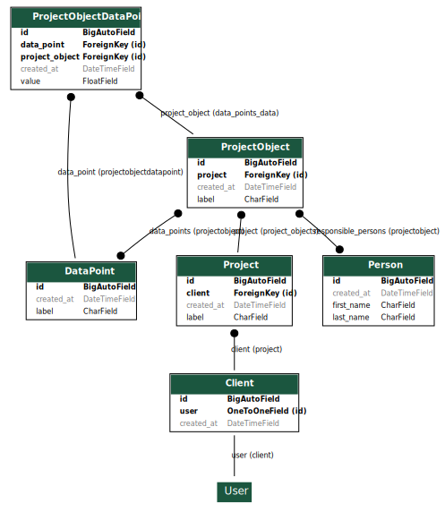

This is a Django-based project that provides a RESTful API for managing clients, projects, persons, data points, and project objects. The project uses PostgreSQL as the database and is containerized using Docker.

## Installation

### Prerequisites

- Docker and Docker Compose installed

### Steps

1. Clone the repository:
   ```bash
   git clone <repository-url>
   cd int-hw
   ```

2. Build and start the Docker containers:
    - The database will be initialized with the provided dump file located at `.dev/db_dump.sql`.
   ```bash
   docker compose up -d
   ```

3. Restart the backend service, after the initial setup of services
    ```bash
    docker compose restart backend
    ```

4. Access the application:
   - API: `http://localhost:8000/api/v1`
   - Admin Panel: `http://localhost:8000/admin/`

## Notes

- Django admin user: `admin/admin`
- Password for each user matches their username
- `.dev/core.http` can be used with VSCode and REST Client extension to make requests
- Request JWT access token with the `api/token` endpoint then use the access token to make subsequent requests to the core API

## Project Structure

```
.
├── core/                   # Main app containing models, views, serializers, and tests
│   ├── admin.py            # Admin interface configuration
│   ├── apps.py             # App configuration
│   ├── models.py           # Database models
│   ├── serializers.py      # API serializers
│   ├── tests.py            # Unit tests
│   ├── urls.py             # App-specific URL routing
│   ├── views.py            # API views
│   └── migrations/         # Database migrations
├── inthw/                  # Project configuration
│   ├── settings.py         # Django settings
│   ├── urls.py             # Project-wide URL routing
│   ├── wsgi.py             # WSGI configuration
│   └── asgi.py             # ASGI configuration
├── .dev/                   # Development utilities
│   ├── core.http           # HTTP requests for testing API endpoints
│   └── db_dump.sql         # PostgreSQL database dump
├── compose.yaml            # Docker Compose configuration
├── Dockerfile              # Dockerfile for building the backend container
├── manage.py               # Django management script
├── requirements.txt        # Python dependencies
└── README.md               # Project documentation
```

## Technology Versions

This project uses the following technologies and their respective versions:

- **Python**: 3.12
- **Django**: 4.2
- **Django REST Framework (DRF)**: 3.16.0
- **PostgreSQL**: 14

## Features

- **JWT Authentication**: Secure API endpoints using JSON Web Tokens (JWT).
- **Versioned API**: API endpoints are versioned (e.g., `/api/v1/`).
- **Role-Based Access Control**: Admin users have full access, while regular users have restricted access.
- **Data Models**:
  - Clients
  - Projects
  - Persons
  - Data Points
  - Project Objects
- **REST API**: CRUD operations for all models using Django REST Framework.



## API Endpoints

### Authentication

- **Retrieve JWT Tokens**: `POST /api/token/`
- **Refresh JWT Token**: `POST /api/token/refresh/`

### Clients

- **List/Create Clients**: `GET/POST /api/v1/clients/`
- **Retrieve/Update/Delete Client**: `GET/PUT/DELETE /api/v1/clients/<id>/`

### Projects

- **List/Create Projects**: `GET/POST /api/v1/projects/`
- **Retrieve/Update/Delete Project**: `GET/PUT/DELETE /api/v1/projects/<id>/`

### Persons

- **List/Create Persons**: `GET/POST /api/v1/persons/`
- **Retrieve/Update/Delete Person**: `GET/PUT/DELETE /api/v1/persons/<id>/`

### Data Points

- **List/Create Data Points**: `GET/POST /api/v1/datapoints/`
- **Retrieve/Update/Delete Data Point**: `GET/PUT/DELETE /api/v1/datapoints/<id>/`

### Project Objects

- **List/Create Project Objects**: `GET/POST /api/v1/objects/`
- **Retrieve/Update/Delete Project Object**: `GET/PUT/DELETE /api/v1/objects/<id>/`

## Environment Variables

Environment variables are not used for simplicity sake, because the project isn't meant to be production ready.
